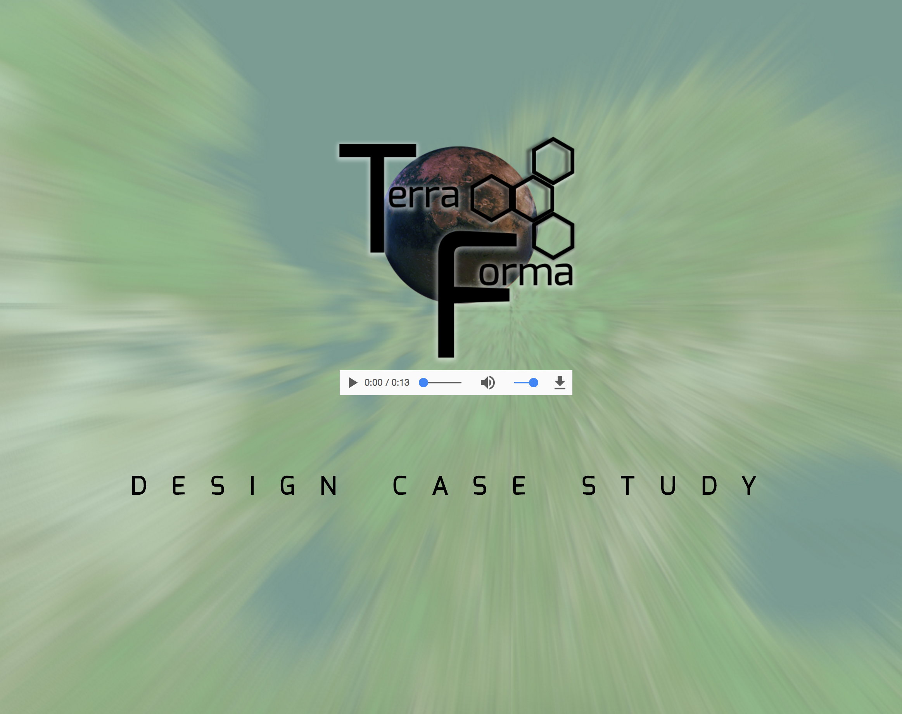

# _Terra Forma_

#### By _**Megan Kaluza, Marty Fitchen, Alex Jacks, Addison Nishijima**_

## Description

_This web application acts as a city planner for colonists in route to Mars. It allows users to select one of four potential settlements and select/place buildings to generate a community. Users can submit finished community proposals, and colony officers can view all submitted community proposals._

## Setup/Installation Requirements

* _Open terminal of choice_
* _To clone using Git, use the following terminal command: https://github.com/megankaluza/terra-forma.git_
* _Open in text editor of your choice_

## Known Bugs

_No known bugs at this time_

## Support and contact details

_Megan Kaluza_
* _email: megan.kaluza@gmail.com_

_Marty Fitchen_
* _email: mfitchen@gmail.com_

_Alex Jacks_
* _email: alexd.jacks@gmail.com_

_Addison Nishijima_
* _email: addison.nishijima@gmail.com_

## Technologies Used

_HTML_
_CSS_
_Squirrelfont_

### License

Copyright (c) 2016 **_Megan Kaluza, Marty Fitchen, Alex Jacks, and Addison Nishijima_**

This software is licensed under the MIT license.

Permission is hereby granted, free of charge, to any person obtaining a copy of this software and associated documentation files (the "Software"), to deal in the Software without restriction, including without limitation the rights to use, copy, modify, merge, publish, distribute, sublicense, and/or sell copies of the Software, and to permit persons to whom the Software is furnished to do so, subject to the following conditions:

The above copyright notice and this permission notice shall be included in all copies or substantial portions of the Software.

THE SOFTWARE IS PROVIDED "AS IS", WITHOUT WARRANTY OF ANY KIND, EXPRESS OR IMPLIED, INCLUDING BUT NOT LIMITED TO THE WARRANTIES OF MERCHANTABILITY, FITNESS FOR A PARTICULAR PURPOSE AND NON-INFRINGEMENT. IN NO EVENT SHALL THE AUTHORS OR COPYRIGHT HOLDERS BE LIABLE FOR ANY CLAIM, DAMAGES OR OTHER LIABILITY, WHETHER IN AN ACTION OF CONTRACT, TORT OR OTHERWISE, ARISING FROM, OUT OF OR IN CONNECTION WITH THE SOFTWARE OR THE USE OR OTHER DEALINGS IN THE SOFTWARE.
